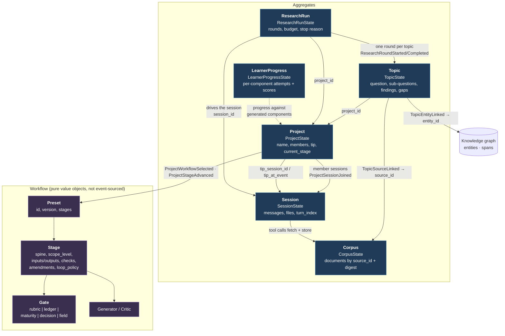

# Domain model

A high-level map of the event-sourced core in `research_team/domain/`. Every
box below is a decider aggregate: a `State` model, a `decide(command, state)`
that returns events, and an `evolve(state, event)` that folds them back. The
arrows are references by id, not object graphs — aggregates never hold each
other.

## The six aggregates

| Aggregate | Identity | What it owns | Key events |
|---|---|---|---|
| **Project** | `project_id` | Membership of sessions, the *tip* (which session's state is canonical and up to which event), the selected workflow preset and the current stage. | `ProjectCreated`, `ProjectSessionJoined`, `ProjectTipAdvanced`, `ProjectWorkflowSelected`, `ProjectStageAdvanced`, `ProjectDeleted` |
| **Session** | `session_id` | One agent conversation: message list, virtual filesystem, turn counter, compaction summary, fork provenance, per-tool autonomy. | `SessionStarted`, `UserMessageSent`, `AssistantMessageAdded`, `ToolResultRecorded`, `TurnCompleted`/`TurnFailed`, `ConversationCompacted`, `SessionForkedFrom`, `FileWritten`/`FileEdited`/`FileDeleted`, `ToolCallDecided`, `AutonomyChanged` |
| **Topic** | `topic_id` | A research question and everything learned about it: sub-questions, linked sources and entities, findings, gaps, contested claims, investigation history. | `TopicOpened`, `TopicSubQuestionAdded`/`Resolved`, `TopicSourceLinked`/`Unlinked`, `TopicEntityLinked`, `TopicInvestigated`, `TopicFindingRecorded`, `TopicGapRecorded`, `TopicContested`/`ContestResolved`, `TopicStatusChanged`, `TopicTriggerAcknowledged` |
| **Corpus** | `corpus_id` | Stored source documents keyed by `source_id`, deduplicated by content digest. | `CorpusDocumentStored`, `CorpusDocumentDropped` |
| **ResearchRun** | `run_id` | An autonomous research loop over a project: a budget (max rounds/turns, quiet rounds, consecutive failures) and one round per topic until a stop reason fires. | `ResearchRunStarted`, `ResearchRoundStarted`/`Completed`/`Failed`, `ResearchRunStopped` |
| **LearnerProgress** | `progress_id` | Attempts, scores and checklist state per `(path, component_id)` against generated course components. | `LearnerItemAnswered`, `LearnerItemCompleted`, `LearnerChecklistRecorded` |

## How the events are named

An event is prefixed with its aggregate when its leading noun is not
exclusively owned by that aggregate — because another module owns it (`Stage`
and `Workflow` belong to `domain/workflow.py`), because it is generic enough
to belong to anything (`Item`), or because it names something that is not the
aggregate (`SourceDocument`).

That is a floor rather than a ceiling. Topic is prefixed throughout and stays
so; Session's events are bare because messages, turns, tool calls, files and
autonomy are Session's and nothing else's. If artifacts ever become their own
aggregate, that is when `FileWritten` earns a prefix — not before.

`docs/superpowers/specs/2026-08-12-aggregate-naming-cohesion-design.md` has
the reasoning and the before/after tables.

## Workflow: configuration, not state

`domain/workflow.py` is the odd one out — frozen Pydantic value objects with no
events. A **Preset** (`addie`, `ubd`, `hybrid` in `research_team/workflows/`) is
an ordered tuple of **Stages**. Each stage declares its position on the spine,
its typed artifact inputs and outputs, the `Check`s that must pass, the
`Generator`/`Critic` roles that produce and challenge its artifacts, an
amendment policy for talking to other stages, and a `LoopPolicy`.

A stage's **Gate** decides who may advance it and with what decision:

- `RubricGate` — scored against criteria
- `LedgerGate` — approve / approve-with-edits / send-back, edits recorded as a delta
- `MaturityGate` — climbs `Rung`s, each with permitted and forbidden changes
- `DecisionGate` — the only gate that may `halt`
- `FieldGate` — gates promotion out of the field

The Project holds only `preset_id`, `preset_version` and `current_stage`; the
preset itself is looked up by id, so advancing a stage is a Project event
validated against a Stage value object.

## How a run flows

1. A **Project** selects a **Preset** and sits on a stage.
2. A **ResearchRun** starts against that project and a driving **Session**.
3. Each round picks a **Topic**, investigates it through the session's tools, and records findings, gaps or contests back onto the topic.
4. Documents the session fetches land in the **Corpus**; the topic links them by `source_id` and links extracted entities into the knowledge graph.
5. The run stops on budget exhaustion, quiet rounds, or consecutive failures — the reason is on `ResearchRunStopped`.
6. Stage output eventually becomes course components; **LearnerProgress** tracks a learner working through them.

## Known rough edges

Not naming problems, and deliberately untouched by the naming pass:

- **`LearnerProgress` is orphaned.** It keys on `(path, component_id)` strings
  with no id-level link to a Project or anything else, which is why its edge
  above is dashed. No frontend code reads its events either.
- **`Project` does two jobs** — session-membership/tip container and
  workflow-stage machine. `ProjectStageAdvanced` and `ProjectSessionJoined`
  advance for unrelated reasons.
- **`ResearchRun` and `Topic` count the same things.**
  `ResearchRoundCompleted.findings` is a tally of what `TopicFindingRecorded`
  already records, which is where drift lives.
- **Turns and rounds sound alike and are not.** `Budget.max_turns` on
  ResearchRun counts a Session's turns from the run's side.
